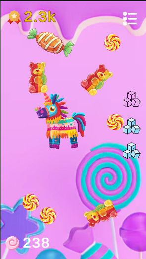
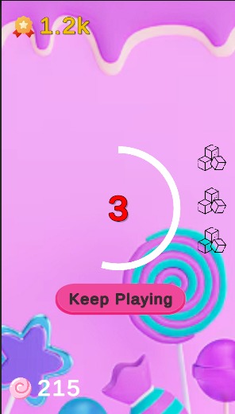
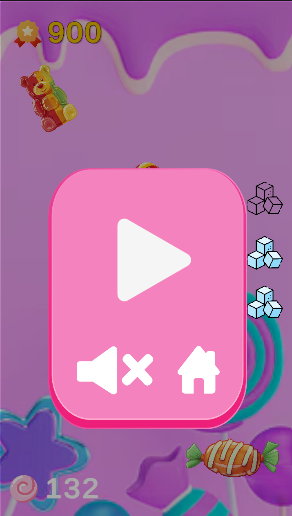

# Slice Mania


**Slice Mania** is an exhilarating, endless mobile game built with Unity 6, inspired by *Fruit Ninja*. Slice through a cascade of falling candies with swift swipes, earning points as each candy splits into two smaller ones, intensifying the challenge! Miss a candy and let it hit the bottom, and you’ll lose one of your three lives—lose all, and it’s game over. Optimized for Android, with WebGL support for browser play on touch devices, this game combines addictive gameplay with ad monetization. Play it now on [itch.io](https://xAgesx.itch.io/SliceMania) or download it directly from the `Release` section!

## Quick Start

### Play Now
1. **Browser**: Head to [itch.io](https://xAgesx.itch.io/slice-mania) and play directly in a mobile browser (touch devices recommended).
2. **Mobile**: Download the APK for Android or IPA for iOS (coming soon) from releases, or build from source.

### Controls
- **Swipe**: Drag your finger across the screen to slice candies. Chain swipes for combo points.
- **Pause**: Tap the pause button (top-right) to access settings or restart.

## Installation & Building from Source

Get *Slice Mania* running locally with these steps.

### Prerequisites
- **Unity**: Unity 6 (2024.3+ recommended)
- **Build Modules**: Android Build Support, iOS Build Support, WebGL Build Support
- **Optional**: Unity Ads SDK (configured in Unity Services for ad integration)

### Setup Instructions
1. Clone the repository:
   ```
   git clone https://github.com/xAgesx/SliceMania-Unity-2D.git
   ```
2. Open the project in Unity Hub by adding the cloned folder.
3. In Unity, go to `File > Build Settings` and select your platform (Android, iOS, or WebGL).
4. Build and run! For quick testing, use the pre-built `SliceMania.exe` in the `/build` folder.

**Note**: Ensure assets (sprites, audio) are correctly referenced. Missing files? Check the `Assets` folder.

## Gameplay Overview

In *Slice Mania*, candies spawn from the top of the screen, and your mission is to slice them before they hit the bottom. The twist? Each sliced candy splits into two smaller ones, ramping up the chaos! Key features include:
- **Endless Gameplay**: No levels, just an infinite challenge to test your reflexes and beat your high score.
- **Scoring**: Earn points per slice, with multipliers for chaining combos or slicing special candies.
- **Lives System**: Start with 3 lives. If a candy reaches the bottom, you lose a life. Zero lives ends the game.
- **Dynamic Spawns**: Randomized candy sizes, speeds, and trajectories keep every session unpredictable.

## Screenshots & Demo
<table style="width:100%; border:0;">
  <tr>
    <td align="center">
      
      <br>
      <p>Slicing candies mid-air with particles flying.</p>
    </td>
    <td align="center">
      
      <br>
      <p>Keep Playing display with retry prompt.</p>
    </td>
    <td align="center">
      
      <br>
      <p>Pause Game with one Click.</p>
    </td>
  </tr>
</table>

Experience it live at [itch.io](https://xAgesx.itch.io/slice-mania)!

## Features

- **Touch-Optimized Controls**: Built with Unity 6’s New Input System for responsive multi-touch swiping on iOS and Android.
- **Procedural Generation**: Candies spawn dynamically with varied properties for endless replayability.
- **Visual & Audio Feedback**: Juicy particle effects and sound effects enhance every slice, powered by Unity’s 2D physics.
- **Ad Integration**: Monetized with AdMob, including interstitials and rewarded ads for extra lives.
- **Mobile Oriented**: Optimized for Android, with WebGL for browser play on touch devices.

## Why This Project?

*Slice Mania* is a testament to my ability to craft polished, mobile-first games in Unity 6. It showcases:
- **Mobile oriented**: Optimized touch controls and performance for iOS and Android.
- **Monetization**: Seamless AdMob integration for real-world application.
- **Gameplay Design**: Engaging, endless mechanics that balance simplicity and challenge.

As a Unity developer, I’m passionate about creating fun, scalable games. This project is an initiative to launch me into more mobile-oriented development !

## Technologies Used

- **Unity 6 2D**: Sprite Renderer and 2D Colliders for candy objects and slice mechanics.
- **New Input System**: Handles touch inputs for mobile and WebGL compatibility.
- **Physics**: 2D Rigidbody for natural falling and collision behavior.
- **VFX & Audio**: Particle System for slice effects; Audio Source for immersive sound feedback.
- **Monetization**: AdMob SDK for ads and rewarded videos.
- **UI**: Unity UI system for responsive menus and in-game HUD.

## Contributions

Contributions are not currently accepted, as I’m focusing on maintaining full control over the project’s direction. However, feedback is welcome—reach out via the contact details below!


Dive into *Slice Mania* and slice your way to glory! 🍬
